# Two-Factor Authentication: A Front-End and Back-End Guide Using Google Authenticator and MERN Stack

Two-factor authentication (2FA), also called multi-factor authentication (MFA), is an open-source standard that greatly enhances user security while being straightforward to implement. Many of the world’s top websites employ this simple yet powerful security measure when logging in their users.

## How does it work?

In addition to the usual username and password pair, you are required to provide an additional secret code, usually 6-digit long, to log in which you obtain from an authenticator application (e.g. [Google Authenticator](https://play.google.com/store/apps/details?id=com.google.android.apps.authenticator2) or [this Chrome extension](https://chrome.google.com/webstore/detail/authenticator/bhghoamapcdpbohphigoooaddinpkbai)) installed in your phone or web browser which you have registered with the platform or website you are logging into by simply scanning a QR code. After the initial setup, the authenticator app doesn’t even need to be online to give you the required secret one-time password (OTP). Magic! Right?

As it is with all things in computer science, it turns out it is not magic, rather it is some interesting logic. At the heart of 2FA/MFA, the kind we are going to implement ([TOTP](https://en.wikipedia.org/wiki/Time-based_one-time_password)), is a cryptographic algorithm. This algorithm takes as input two things:

1. The current time on the clock accurate to the second
2. A user-specific permanent secret key (separate from the OTP, shared securely during setup)

It uses these two things to generate a time-sensitive OTP usually consisting of 6 digits. By having the back-end server and the authenticor app share this permanent secret and their clocks (thanks to [NTP](https://en.wikipedia.org/wiki/Network_Time_Protocol) in most cases), the authenticator app's claim of possessing the secret previously shared by the server can be verified without sharing the secret directly. This claim is used for user authentication. Usually the OTP is confirmed from the user one time before enabling 2FA for their account to ensure that the secret contained in the QR code has been properly set up in their authenticator app, saving the user from getting locked out of their account in case it doesn't work.

## Prerequisites for this tutorial

Before starting, make sure you have a recent version of the following installed and set up:

1. Node.js
2. MongoDB
3. Postman with [this collection](https://github.com/salman-farooq-sh/2fa/blob/main/backend/postman/Express-2FA.postman_collection.json) imported (tip: drag and drop this file in Postman)
4. Google Authenticator (or any other similar app e.g. [this one](https://chrome.google.com/webstore/detail/authenticator/bhghoamapcdpbohphigoooaddinpkbai), the keyword to search for is "TOTP")

## So let’s start!

Begin by creating a new empty directory called `2fa` which will hold the code for both our Express backend and React frontend. We will start with the backend and test it with Postman as we go. Create another directory called `backend` inside `2fa` and run this in it:

```bash
npm init -y
```

This will initialize the project by creating a brand new `package.json` file in the back-end project root with default values. Next, install the packages we will be using:

```bash
npm install bcrypt cors express jsonwebtoken mongoose otplib passport passport-jwt passport-local qrcode
```

All these packages will be installed in the project's newly created `node_modules` folder which you can inspect with your file explorer if you are curious. Now create and open a file called `index.js` in the project root which will be the entry point for our code and put this in it:

```javascript
const express = require("express");

const PORT = 9001;
const app = express();

app.get(
  "/hello", (req, res) => {
    res.json('hello world!')
  }
);

app.listen(PORT, () =>
  console.log(`Express started on http://localhost:${PORT}`)
);
```

And then run it with:

```bash
node index.js
```

This will create and start a basic Express server which you can test by going to [http://localhost:9001/hello](http://localhost:9001/hello) in your browser. While using the browser is nice, we will soon want more control over making requests to our server and for this purpose we will start using Postman from the get-go:


Delete the sole `app.get()` call in `index.js` because it was only for demonstration. Let’s go ahead and make a dedicated `controllers.js` file for our controllers and put the following code in it:

```javascript
const signup = async (req, res) => {
  return res.status(201).json({
    message: "Signup successful",
    user: req.user,
  });
};

module.exports = {
  signup,
};
```

We need to wire this controller in our routes for it to actually do anything. Modify the `index.js` file so that it looks like this:

```javascript
const cors = require("cors");
const express = require("express");
const controllers = require("./controllers")

const PORT = 9001;
const app = express();

app.use(express.json());

app.use("/api", cors());

app.post(
  "/api/signup",
  controllers.signup
);

app.listen(PORT, () =>
  console.log(`Express started on http://localhost:${PORT}`)
);
```

Restart the server and use Postman to test the new endpoint:

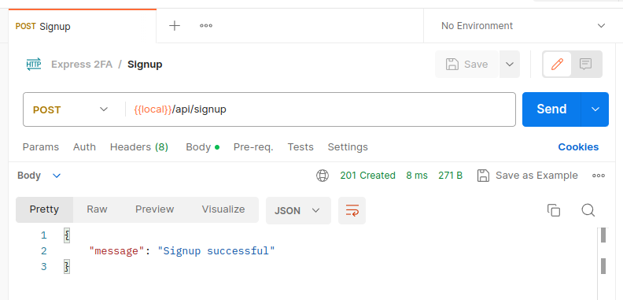

We haven’t written the logic to actually create a new user just yet and we also used a `req.user` object in our signup controller which is not showing up in the response to our request in Postman. Let’s remedy this by first writing the database setup code and then the logic to create a new user in the database. Finally, we will put everything together so that our signup endpoint actually signs up a new user.

Create `db.js` with this in it:

```javascript
const mongoose = require("mongoose");

mongoose.connect("mongodb://127.0.0.1:27017/2fa");

const db = mongoose.connection;

db.on("error", (err) => {
  console.error(`MongoDB Error: ${err.message}`);
  process.exit(1);
});

db.once("open", () => {
  console.log("MongoDB connection successful");
});

require("./models");
```

This will set up and establish our connection with MongoDB. Next create the missing `models.js` file which we are importing above at the end:

```javascript
const mongoose = require("mongoose");
const bcrypt = require("bcrypt");

const UserSchema = new mongoose.Schema({
  email: {
    type: String,
    required: true,
    unique: true,
  },
  password: {
    type: String,
    required: true,
  },
  age: {
    type: Number,
    required: true,
  },
  twofaEnabled: {
    type: Boolean,
    default: false,
  },
  twofaSecret: {
    type: String,
    default: "",
  },
});

UserSchema.methods.verifyPassword = async function (password) {
  return await bcrypt.compare(password, this.password);
};

const UserModel = mongoose.model("user", UserSchema);

module.exports = { UserModel };
```

We use mongoose to simplify our interaction with MongoDB. `UserSchema` contains all the necessary fields we will need to make a functioning example, one of which is optional and represents any extra data we would want to attach to a user; the age field. Other such fields can be added or removed as required. We also define a method on the schema to compare passwords. 

Next up, we will write the logic to create a new user, create `auth.js` with this in it:

```javascript
const passport = require("passport");
const extractJwt = require("passport-jwt").ExtractJwt;
const jwtStrategy = require("passport-jwt").Strategy;
const localStrategy = require("passport-local").Strategy;
const { UserModel } = require("./models");
const env = require("./env");
const bcrypt = require("bcrypt");

passport.use(
  "signup",
  new localStrategy(
    {
      usernameField: "email",
      passwordField: "password",
      passReqToCallback: true,
    },
    async (req, email, password, done) => {
      try {
        if (await UserModel.findOne({ email })) {
          return done(null, false, {
            message: `User with email ${email} already exists`,
          });
        }

        const hashedPassword = await bcrypt.hash(password, 10);

        const user = await UserModel.create({
          email,
          password: hashedPassword,
          age: req.body.age,
        });

        return done(null, {
          email: user.email,
          age: user.age,
        });
      } catch (error) {
        return done(error);
      }
    }
  )
);
```

We are creating a middleware using passport which checks if a user with the requested email already exists, if not then it goes ahead and creates the user with the password hashed with a randomly generated salt. This is what adds the `.user` attribute to the `req` object in the signup controller. Don’t mind the extra imports up top, we will use them shortly. For now, we are missing an environment file which holds sensitive server configuration. Create `env.js` with the following content:

```javascript
module.exports = {
  JWT_SECRET: "YOUR_TOP_SECRET_KEY_HERE",
};
```

Now we need to use this newly created middleware with our signup controller. Edit `index.js` and add `passport.authenticate("signup", { session: false })` as the second argument to the `app.post()` call so that it starts acting as a middleware for just the signup controller. It will look like this:

```javascript
...
const passport = require("passport");
const db = require("./db");
const auth = require("./auth");
...
app.post(
  "/api/signup",
  passport.authenticate("signup", { session: false }),
  controllers.signup
);
...
```

The signup endpoint is now complete and can be tested with Postman after restarting the server:

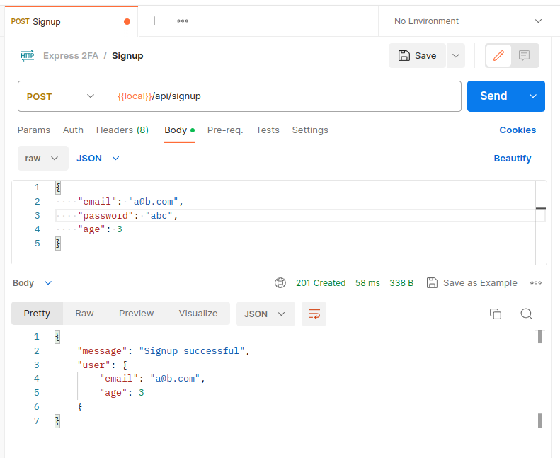

Note that signing up with the same email again will not work:

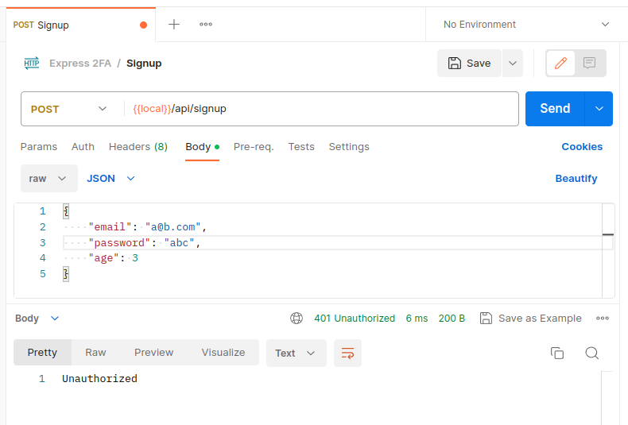

Let’s create the login endpoint now. Edit `controllers.js`:

```javascript
const qrcode = require("qrcode");
const jwt = require("jsonwebtoken");
const passport = require("passport");
const { authenticator } = require("otplib");
const env = require("./env");
const { UserModel } = require("./models.js");

...

const login = async (req, res, next) => {
  passport.authenticate(
    "login",
    { session: false },
    async (err, user, info) => {
      if (err || !user) {
        return res.status(401).json({
          message: "Invalid email or password",
        });
      }

      if (!user.twofaEnabled) {
        return res.json({
          message: "Login successful",
          twofaEnabled: false,
          token: jwt.sign(
            {
              user: { email: user.email },
            },
            env.JWT_SECRET
          ),
        });
      } else {
        return res.json({
          message: "Please complete 2-factor authentication",
          twofaEnabled: true,
          loginStep2VerificationToken: jwt.sign(
            {
              // important to keep this payload different from a real/proper
              // authentication token payload so that this token cannot be used
              // for real/proper authentication defeating the whole point of
              // 2-factor authentication
              loginStep2Verification: { email: user.email },
            },
            env.JWT_SECRET,
            { expiresIn: "5m" }
          ),
        });
      }
    }
  )(req, res, next);
};

module.exports = {
  ...
  login,
};
```

This controller receives a user object in the parameters which is supplied by the `login` passport middleware. It returns a matching response on invalid email or password. If the email and password are valid, it returns the final authentication JWT if Two-Factor Authentication is not enabled and if it is enabled, it returns an intermediate step-2 JWT which is required for verifying that we are coming to login step-2 after having completed the login step-1 properly, it does not function as the final authentication JWT.

Create the missing login passport middleware at the end of `auth.js`:

```javascript
passport.use(
  "login",
  new localStrategy(
    {
      usernameField: "email",
      passwordField: "password",
      passReqToCallback: true,
    },
    async (req, email, password, done) => {
      try {
        const user = await UserModel.findOne({ email });

        if (!user) {
          return done(null, false, {
            message: "Invalid email or password",
          });
        }

        const validate = await user.verifyPassword(password);

        if (!validate) {
          return done(null, false, {
            message: "Invalid email or password",
          });
        }

        return done(null, user, {
          message: "Logged in successfully",
        });
      } catch (error) {
        return done(error);
      }
    }
  )
);
```

Now simply use the login controller in a route in `index.js` just like before:

```javascript
...
app.post("/api/login", controllers.login);
...
```

The login endpoint is now complete. Test in Postman:

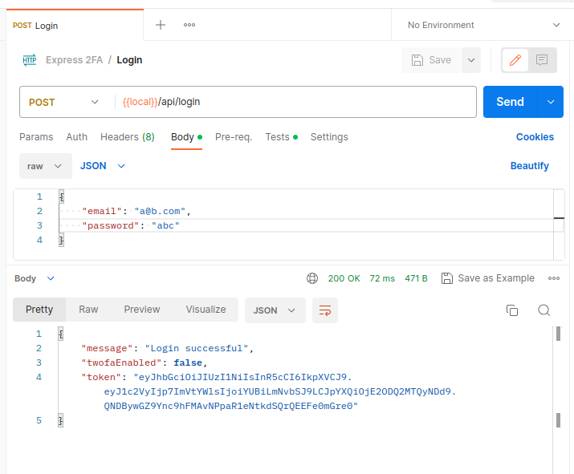

Note that this is the response only when 2FA is not enabled. We will later look at a different response when 2FA is enabled. Also note that this Postman collection has been configured to automatically extract the tokens in this response into their own collection variables which can then be easily used in other Postman requests:

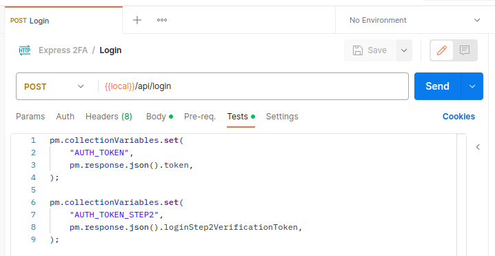

Now that we are successfully generating valid authentication JWTs, let’s use them to make a protected `/api/profile`
route which only logged in users can access. As you can guess, we will be making another passport middleware. This one will check that the JWT coming with the request has been in fact generated with our `JWT_SECRET` i.e. that it is valid. If yes, it will attach a `.user` object with the `req` objects of controllers configured to use this middleware based on the email within the JWT payload. Append this to `auth.js`:

```javascript
passport.use(
  "jwt",
  new jwtStrategy(
    {
      secretOrKey: env.JWT_SECRET,
      jwtFromRequest: extractJwt.fromAuthHeaderAsBearerToken(),
    },
    async (token, done) => {
      try {
        const user = await UserModel.findOne({
          email: token.user?.email,
        });
        return done(null, {
          email: user.email,
          age: user.age,
          twofaEnabled: user.twofaEnabled,
        });
      } catch (error) {
        return done(error);
      }
    }
  )
);
```

Next create the profile controller in `controllers.js`:

```javascript
const profile = async (req, res) => {
  return res.json({
    message: "Success",
    user: req.user,
  });
};

module.exports = {
  ...
  profile,
};
```

And add the profile route in `index.js`:

```javascript
...
app.get(
  "/api/profile",
  passport.authenticate("jwt", { session: false }),
  controllers.profile
);
...
```

The protected profile endpoint is now complete. Test in Postman after restarting the server:

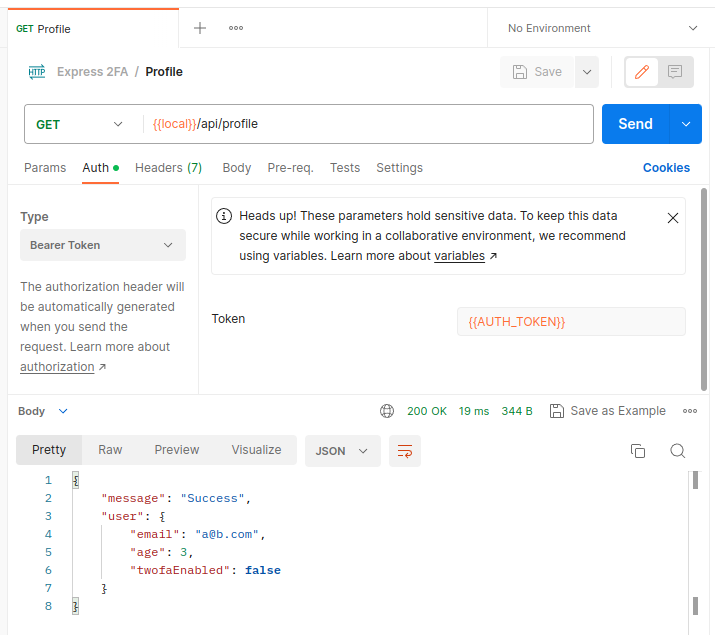

Try replacing `{{AUTH_TOKEN}}` with an invalid JWT and you will be told you are not authorized to use this endpoint.

Next up, we will write the two endpoints to enable 2FA for a user. The first endpoint `/api/generate-2fa-secret` will generate and store a 2FA secret for a user. The second endpoint `/api/verify-otp` will verify that the user can successfully generate valid OTPs based on the given 2FA secret (using an authenticator app) and then enable 2FA for the user. Both of these endpoints will be protected i.e. only a logged in user with a valid authentication JWT will be able to use them. In `controllers.js`, add the following code:

```javascript
const generate2faSecret = async (req, res) => {
  const user = await UserModel.findOne({ email: req.user.email });

  if (user.twofaEnabled) {
    return res.status(400).json({
      message: "2FA already verified and enabled",
      twofaEnabled: user.twofaEnabled,
    });
  }

  const secret = authenticator.generateSecret();
  user.twofaSecret = secret;
  user.save();
  const appName = "Express 2FA Demo";

  return res.json({
    message: "2FA secret generation successful",
    secret: secret,
    qrImageDataUrl: await qrcode.toDataURL(
      authenticator.keyuri(req.user.email, appName, secret)
    ),
    twofaEnabled: user.twofaEnabled,
  });
};

const verifyOtp = async (req, res) => {
  const user = await UserModel.findOne({ email: req.user.email });
  if (user.twofaEnabled) {
    return res.json({
      message: "2FA already verified and enabled",
      twofaEnabled: user.twofaEnabled,
    });
  }

  const token = req.body.token.replaceAll(" ", "");
  if (!authenticator.check(token, user.twofaSecret)) {
    return res.status(400).json({
      message: "OTP verification failed: Invalid token",
      twofaEnabled: user.twofaEnabled,
    });
  } else {
    user.twofaEnabled = true;
    user.save();

    return res.json({
      message: "OTP verification successful",
      twofaEnabled: user.twofaEnabled,
    });
  }
};

module.exports = {
  ...
  generate2faSecret,
  verifyOtp,
};
```

And then connect them with their routes in `index.js`:

```javascript
...
app.post(
  "/api/generate-2fa-secret",
  passport.authenticate("jwt", { session: false }),
  controllers.generate2faSecret
);

app.post(
  "/api/verify-otp",
  passport.authenticate("jwt", { session: false }),
  controllers.verifyOtp
);
...
```

These two endpoints are now complete. Test them in Postman after restarting the server:

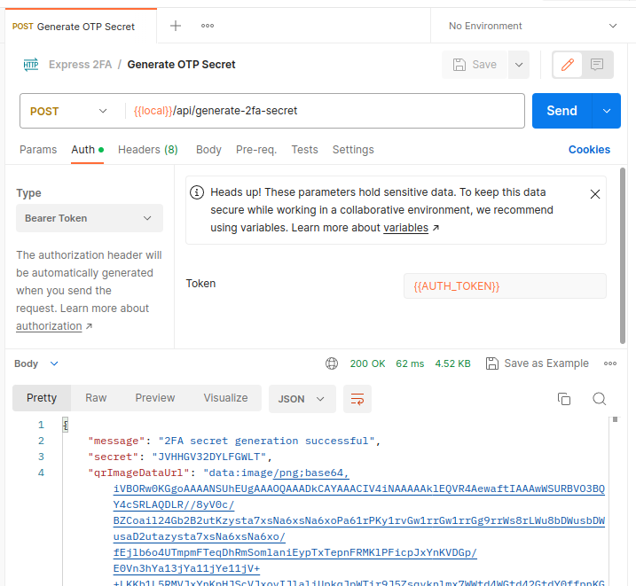

Now, either input the secret manually in Google Authenticator or display the QR code image data and scan it. Let’s go with scanning. Copy the whole super long string start to end in the above response and put it in a new file called `qr.html` like this:

``

Now open this file in a browser and you will see a QR code. Scan this QR code with Google Authenticator and voila! You will start seeing your 2FA OTPs. Alternatively, a short script of our own can be written to do the same job, create `generateAuthenticator2faTokenFromSecret.js`:

```javascript
const authenticator = require("otplib").authenticator;

const SECRET = process.argv[2];

async function main() {
  while (true) {
    const d = new Date();

    process.stdout.write(
      "\u001b[2K\u001b[0G" + // ANSI escape sequences to clear line and move cursor to line start
        `Secret: ${SECRET}` +
        ` | OTP: ${authenticator.generate(SECRET)}` +
        ` | OTP expires in: ${authenticator.timeRemaining()}s` +
        ` | Current Time: ${d.getHours()}h:${d.getMinutes()}m:${d.getSeconds()}s`
    );

    // sleep for 1000ms
    await new Promise((r) => setTimeout(r, 1_000));
  }
}

main();
```

Run it with:

```bash
node generateAuthenticator2faTokenFromSecret.js "<YOUR-2FA-SECRET>"
```

Any way you obtain the OTP, it’s not done yet. We still have to verify an OTP once to properly enable 2FA for our user:

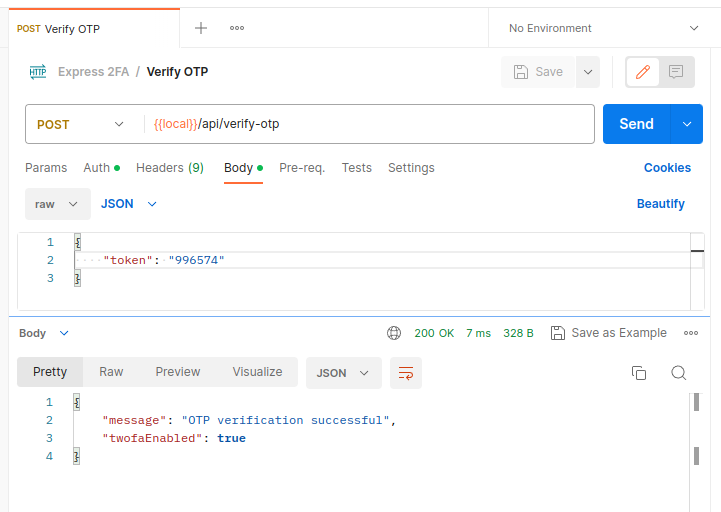

After making the request above with the correct time-sensitive OTP, 2FA will be enabled for our user. Our existing authentication JWT will remain valid though. But if we visit the login endpoint now with same credentials as before, we see this:

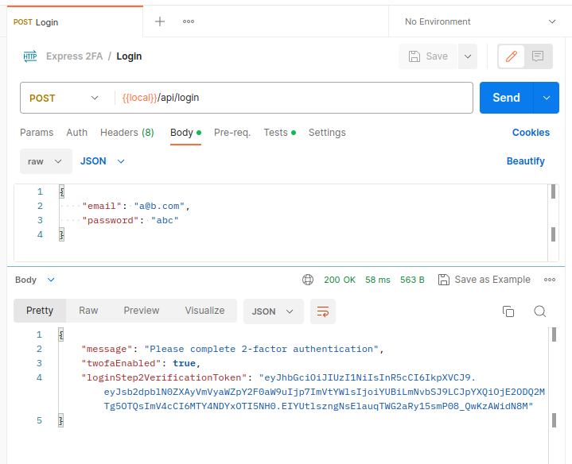

Let’s create the login step-2 endpoint now. Make a new controller which will return final authentication JWTs given a valid pairs of a intermediate step-2 verification token and a 2FA OTP:

```javascript
const loginStep2 = async (req, res) => {
  let loginStep2VerificationToken = null;
  try {
    loginStep2VerificationToken = jwt.verify(
      req.body.loginStep2VerificationToken,
      env.JWT_SECRET
    );
  } catch (err) {
    return res.status(401).json({
      message: "You are not authorized to perform login step-2",
    });
  }

  const token = req.body.twofaToken.replaceAll(" ", "");
  const user = await UserModel.findOne({
    email: loginStep2VerificationToken.loginStep2Verification.email,
  });
  if (!authenticator.check(token, user.twofaSecret)) {
    return res.status(400).json({
      message: "OTP verification failed: Invalid token",
    });
  } else {
    return res.json({
      message: "OTP verification successful",
      token: jwt.sign(
        {
          user: { email: user.email },
        },
        env.JWT_SECRET
      ),
    });
  }
};

module.exports = {
  ...
  loginStep2,
};
```

Add it to the routes in `index.js`:

```javascript
...
app.post("/api/login-step2", controllers.loginStep2);
...
```

Login step-2 endpoint is now complete. Restart the server and then in Postman, hit the login step-1 endpoint to obtain the intermediate JWT and then hit the login step-2 endpoint:

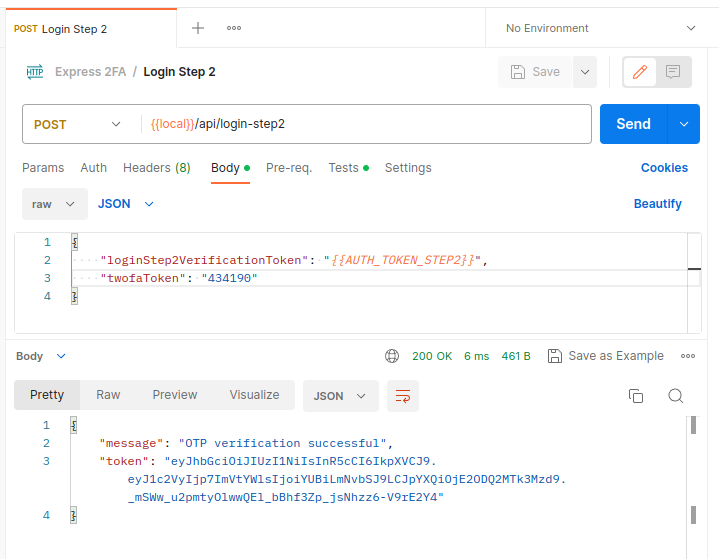

Our backend is now almost complete, now we just need a way to disable 2FA for a user, which turns out to be rather simple. In `controllers.js`:

```javascript
const disable2fa = async (req, res) => {
  const user = await UserModel.findOne({ email: req.user.email });
  user.twofaEnabled = false;
  user.twofaSecret = "";
  await user.save();

  return res.json({
    message: "2FA disabled successfully",
    twofaEnabled: user.twofaEnabled,
  });
};

module.exports = {
  ...
  disable2fa,
};
```

And in `index.js`:

```javascript
app.post(
  "/api/disable-2fa",
  passport.authenticate("jwt", { session: false }),
  controllers.disable2fa
);
```

Our backend is now complete, restart the server and try the endpoint in Postman:

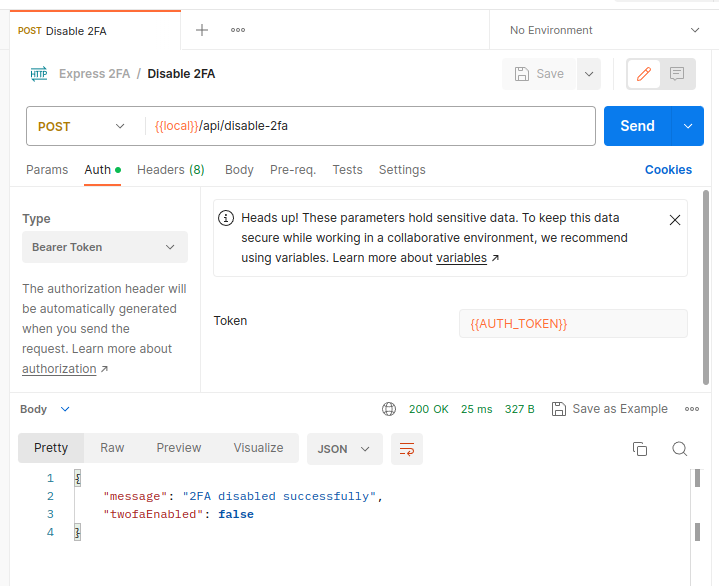

Complete code for the backend is available [here](https://github.com/salman-farooq-sh/2fa/tree/main/backend).

## On to the Front-End…
_Coming soon_

---

_Originally authored by me for [Esketchers](https://esketchers.com/) at [esketchers.com/implementing-2fa-with-mern-stack](https://esketchers.com/implementing-2fa-with-mern-stack/)._
